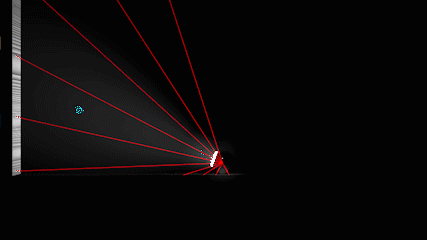

# THE LIGHTER
Started with the game idea: <b>What you don't see is not real!

#### Story Cover and Play

&nbsp;&nbsp;&nbsp;&nbsp; It's a 2.5D game where you play as Lumino, the ball with the magical flashlight  
&nbsp;&nbsp;&nbsp;&nbsp; Anything you can't see without the flashlight only exists when it's lit by it

 

(Game Idea & Main Mechanic) 

 

## This mechanic allows for some <b>real cool physics-based level designs</b>

(LighterBlocks in <b>1-DIMENSION</b>. I call it the <b>LighterStairs</b>) 

 

(LighterBlocks in <b>2-DIMENSIONS</b>) 

 

## Feature Highlights
### The Tracer-Algorithm
This algorithm demonstrates how Lumino's flashlight works

 

#### The Technique
What's my idea behind the <b>2-Layer-Buffer algorithm</b> for the tracer,  
is that if you want to prevent the CollisionToggles to be called on every tracer hit/miss  
you'd want to have <b>something that's one step behind</b> (Less sensitive) to the tracer hits/misses:  

1. Since there are multiple line traces (which reduces trace misses), we'd need to add an 
 	 <b>EXTRA DATA STRUCTURE</b> to handle how many LighterBlocks we've hit in one group trace
	 It's called the <b>"HITSET"</b>

2. <b>HITSET</b> in turn controls what objects we have in a list that contains the actual <b>LIT ITEMS</b>
	 It's called the <b>"LITSET"</b>

3. We need the <b>LITSET</b> because we need to toggle the collisions on the LigterBlocks <b>ONLY ONCE</b>
 
##### NOTE: 
* HitSet => It is <b>PER-LINE-TRACE</b> sensitive
* LitSet => It is <b>PER-FRAME</b> sensitive

 

  
Tracer running in Debug Mode

 

#### Simplified Algorithm
1. Trace out N lines along your SpotLight's Cone

2. If you hit a LighterBlock on any of the traces
		a. Call the ToggleCollision function on it to enable collision
		b. Add it to the list of Lit Items

3. If all of your traces fail to find the LighterBlock
		a. Call the ToggleCollision again to disable collision
		b. Remove it from the list

##### NOTE:
* The ToggleCollision function only sets the target collision, but the real collision change occurs when NOTHING's overlapping the LighterBlock
